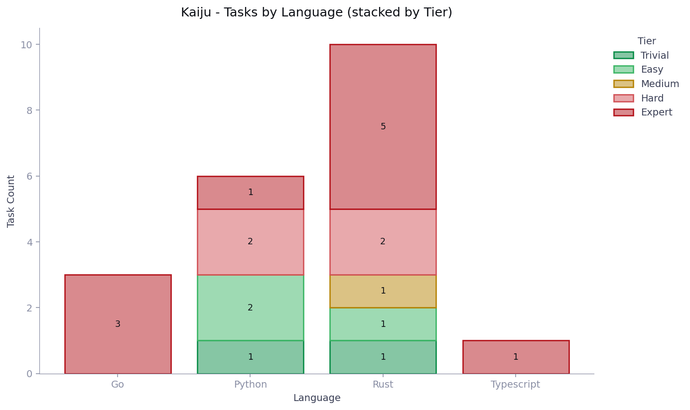
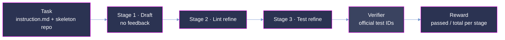
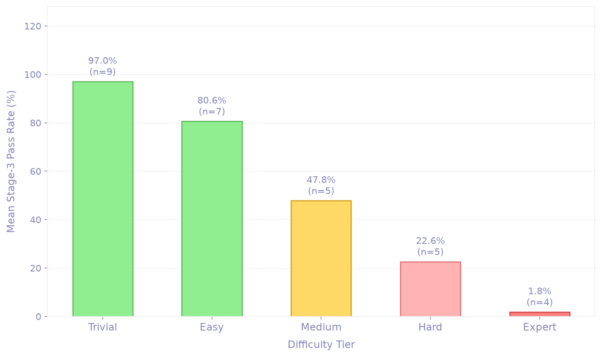

<p align="center">
  
</p>

<p align="center">
  <strong>From-scratch library implementation tasks in Harbor format, with the complete Claude Opus 4.8 agent trajectories for every pipeline stage.</strong>
</p>

<p align="center">
  <a href="#summary"></a>
  <a href="#scoring-methodology"></a>
  <a href="#three-stage-evaluation-pipeline"></a>
  <a href="#verification-and-quality-assurance"></a>
</p>

<p align="center"><sub>
  <a href="#summary">Summary</a> · <a href="#repository-layout">Layout</a> · <a href="#task-inventory">Inventory</a> · <a href="#task-design">Task design</a> · <a href="#three-stage-evaluation-pipeline">Pipeline</a> · <a href="#dataset-structure">Dataset</a> · <a href="#trajectory-structure">Trajectories</a> · <a href="#scoring-methodology">Scoring</a> · <a href="#usage-notes">Usage</a> · <a href="#verification-and-quality-assurance">Verification</a>
</sub></p>

# Kaiju: Library Generation from Scratch

**Kaiju measures whether an agent can implement an entire library from a stubbed skeleton, not
just patch an isolated bug.** Each task drops the agent into a containerized checkout of a real
open-source repository at `/testbed`, reset to a *skeleton commit*: every function body in the
source directory has been replaced with a stub that raises/throws on call. The agent must
implement the full library — architecture, multi-file coordination, project conventions — and is
graded on the fraction of the repository's *official test IDs* that pass. Where SWE-style
benchmarks localize a fix inside a working codebase, Kaiju starts from an empty shell and demands
the whole organism.

Every instance is evaluated through a **three-stage sequential pipeline** (Draft → Lint refine →
Test refine). This release ships **20 tasks** across **4 languages (Rust, Go, Python, TypeScript)** in
[Harbor](https://github.com/laude-institute/harbor) task format (schema 1.3), together with the
**complete agent trajectories of Claude Opus 4.8** — one ATIF v1.7 trace per pipeline stage per
module, **1,278 traces** in total.

> **This is a quality-controlled release of the Kaiju corpus.** The task format (Harbor
> `task.toml` schema 1.3), the trajectory format (ATIF v1.7), and the scoring harness are
> identical to the production deliveries. All instances passed a 24-criterion quality-assurance
> protocol prior to inclusion.

## Summary

| Property            | Value                                                                              |
| :------------------ | :--------------------------------------------------------------------------------- |
| Tasks               | **20** from-scratch library implementation instances                               |
| Languages           | **Rust (10) · Go (3) · Python (6) · TypeScript (1)**                                                 |
| Difficulty          | All **Hard** (20 tasks)                                                             |
| Model evaluated     | **Claude Opus 4.8** (`claude-opus-4.8`)                                            |
| Pipeline            | 3 sequential stages — Draft (no feedback) → Lint refine → Test refine              |
| Agent traces        | **1,278** ATIF v1.7 trajectories (per stage × module), 8–240 per task            |
| Held-out tests      | **11,189** official test IDs total (2–3,191 per task)                              |
| Reward              | continuous `passed / total ∈ [0, 1]`, written by `tests/test.sh` at grading time   |
| Task format         | [Harbor](https://github.com/laude-institute/harbor) `task.toml` schema 1.3         |
| Execution           | pre-built per-task Docker images, 2 CPUs / 4 GB, `workdir /testbed`                |

## Repository layout

```
kaiju-samples/
├── README.md                          # this document
├── images/
│   └── hero.png                       # README banner
├── datasets/                          # task definitions, one directory per UUID (20)
│   └── <uuid>/
│       ├── task.toml                  # Harbor schema 1.3 metadata
│       ├── instruction.md             # the prompt presented to the agent
│       ├── solution/
│       │   └── solve.sh               # oracle: fetch + hard-reset to the reference commit
│       └── tests/
│           ├── test_ids.txt           # official test IDs, one per line
│           └── test.sh                # verifier entrypoint: run suite, score IDs, write reward
└── trajectory/                        # Claude Opus 4.8 runs, one directory per UUID (20)
    └── <uuid>/
        ├── results.json               # per-stage run metrics (model, timing, cost, pass rates)
        ├── verifier/
        │   └── reward.json            # per-stage verifier scores
        └── agent/
            └── <stage>__<repo>__<module>/  # stage ∈ {draft, lint, test}
                └── trajectory.json    # ATIF v1.7 structured trace of that agent session
```

Task UUIDs map **1:1** between `datasets/` and `trajectory/` (20 each). A task's repository,
language, and difficulty are recorded in its `task.toml` (`[metadata]` and `[task].keywords`).
One-liners to list tasks by language:

```bash
grep -l '"rust"'   datasets/*/task.toml | xargs -n1 dirname | xargs -n1 basename   # 10 Rust
grep -l '"go"'     datasets/*/task.toml | xargs -n1 dirname | xargs -n1 basename   # 3 Go
grep -l '"python"' datasets/*/task.toml | xargs -n1 dirname | xargs -n1 basename   # 6 Python
```

## Task inventory

| Task (UUID prefix) | Upstream project | Language | Test IDs | Agent traces |
|---|---|---|---:|---:|
| `36e9ad11` | pytransitions/transitions                | Python | 3,191 |    29 |
| `70e7561f` | go-acme/lego                             | Go     | 2,155 |   103 |
| `061e0bde` | pipefunc/pipefunc                        | Python | 1,441 |   132 |
| `712a3f90` | JulianSchmid/etherparse                  | Rust   | 1,123 |   212 |
| `6ce3f6af` | orion-rs/orion                           | Rust   |   836 |    63 |
| `70967708` | ZcashFoundation/frost                    | Rust   |   577 |    78 |
| `117c2b9a` | jurismarches/luqum                       | Python |   385 |    35 |
| `96fc09ec` | distribution/distribution                | Go     |   309 |    11 |
| `22975479` | erg-lang/erg                             | Rust   |   215 |   150 |
| `ba9106bd` | remoc-rs/remoc                           | Rust   |   200 |     9 |
| `6ceca035` | oxfordcontrol/Clarabel.rs                | Rust   |   178 |   240 |
| `acb7e739` | asynchronics/nexosim                     | Rust   |   161 |    23 |
| `5dcec30e` | isidentical/refactor                     | Python |   139 |    17 |
| `01c3b086` | wq2012/SpectralCluster                   | Python |    77 |    25 |
| `2bfb26d0` | grpc/grpc-go                             | Go     |    68 |    47 |
| `4ed62c04` | szimek/signature_pad                     | Typescript |    60 |    14 |
| `cce1e47b` | paritytech/jsonrpc                       | Rust   |    32 |    18 |
| `8e56d356` | airbus-cert/etl-parser                   | Python |    23 |    32 |
| `a702d200` | b23r0/rust-raknet                        | Rust   |    17 |    32 |
| `b193a4d1` | andreev-io/little-raft                   | Rust   |     2 |     8 |


Trace counts scale with the number of modules in the source directory, not with test count — a
task with a wide module tree (e.g. `Clarabel.rs`, `etherparse`) yields a draft and lint trace
for nearly every module, while a compact crate (e.g. `little-raft`, `remoc`) needs only a
handful of sessions per stage.

<p align="center">
  <picture>
    <source media="(prefers-color-scheme: dark)" srcset="images/kaiju_tasks_by_language-dark.png">
    
  </picture>
</p>

## Task design

Existing code-generation evaluations predominantly test function-level synthesis (HumanEval,
MBPP) or isolated bug-fixing (SWE-bench). Neither captures the complexity of building an entire
software library: architectural reasoning, multi-file coordination, dependency management, and
adherence to project-wide conventions. Kaiju targets exactly that gap.

Each instance is:

- **A real open-source library** with an established, commit-pinned test suite.
- **Reset to a skeleton commit** (`base_commit`): every function body in the source directory
  (`src_dir`) is replaced by a stub that throws on call. Names, signatures, and exported symbols
  are preserved; the agent must not rename them.
- **Paired with a reference commit** (`reference_commit`): the upstream working implementation,
  used as the oracle ceiling (`solution/solve.sh` restores it).
- **Containerized**: a pre-built Docker image per task pins the language toolchain, dependencies,
  and test runner (`[environment]` in `task.toml`).
- **Graded against official test IDs**: the exact file-level or assertion-level test identifiers
  in `tests/test_ids.txt` — the agent never sees the verifier.

The agent receives `instruction.md` (task brief + repository details + embedded specification)
and works inside `/testbed`. It must implement only the library source under `src_dir` and must
not modify test files. Tasks span five measured difficulty tiers (Trivial → Expert) and
non-trivial domain logic: cryptography, network protocols, numeric solvers, state machines,
and parsers.

## Three-stage evaluation pipeline

Each task is evaluated through three sequential stages; each stage's output is the next stage's
input, and each stage is scored by the same verifier:

1. **Stage 1 — Draft (no feedback).** The agent receives `instruction.md` and generates an
   initial implementation of the complete library. No external feedback.
2. **Stage 2 — Lint refine.** The generated code is passed through automated linting; the agent
   revises its output in response to lint diagnostics.
3. **Stage 3 — Test refine.** The revised code runs against the official test suite; the agent
   iterates on failures. The Stage 3 pass rate is the primary metric.



Agent traces are captured **per stage and per module**: a task whose source directory spans `k`
modules yields up to `3 × k` trajectory files (`draft__*`, `lint__*`, `test__*`), each a complete
ATIF v1.7 record of that stage's agent session. Test-refine traces can be very large (up to
~430 MB for the `erg` task) because they embed full test-run feedback.

## Results

Mean Stage-3 pass rate for Claude Opus 4.8 across the corpus, by difficulty tier and by
language. All 20 tasks share the Hard difficulty tier; language is the primary performance
differentiator across the corpus.

<p align="center">
  <picture>
    <source media="(prefers-color-scheme: dark)" srcset="images/kaiju_pass_rate_per_tier-dark.png">
    
  </picture>
</p>

<p align="center">
  <picture>
    <source media="(prefers-color-scheme: dark)" srcset="images/kaiju_pass_rate_per_language-dark.png">
    
  </picture>
</p>

## Dataset structure

Each task lives under `datasets/<uuid>/` and is fully self-contained:

```
datasets/<uuid>/
├── task.toml                 # Harbor schema 1.3: task, metadata, agent, verifier, environment
├── instruction.md            # the prompt presented to the agent (brief + spec)
├── solution/
│   └── solve.sh              # oracle: fetch + hard-reset to the reference commit
└── tests/
    ├── test_ids.txt          # official test IDs (file-level or assertion-level), one per line
    └── test.sh               # verifier entrypoint: run suite, score IDs, write reward.json
```

### `task.toml` fields

| Section         | Field                              | Description                                                        |
| :-------------- | :--------------------------------- | :----------------------------------------------------------------- |
| *(root)*        | `schema_version`                   | Harbor task schema (`"1.3"`)                                       |
| *(root)*        | `source`                           | Task provenance (`"commit0"`)                                      |
| `[task]`        | `name`, `description`, `keywords`  | Human-readable identity + tags (language, `swe`, `code-generation`) |
| `[metadata]`    | `uuid`                             | Task UUID; matches the directory name                              |
| `[metadata]`    | `category` / `difficulty`          | `"code-generation"` / `"hard"` (all tasks in this release)         |
| `[metadata]`    | `original_repo` / `instance_id`    | Upstream GitHub repo / instance identifier                         |
| `[metadata]`    | `base_commit`                      | 40-char SHA of the skeleton (stubbed) commit                       |
| `[metadata]`    | `reference_commit`                 | 40-char SHA of the working reference implementation                |
| `[metadata]`    | `src_dir`                          | Source directory the agent must implement                          |
| `[metadata]`    | *(runtime pin)*                    | Language-specific runtime version key                              |
| `[metadata]`    | `test_mode` / `n_test_ids`         | `"official_test_ids"` / size of the graded ID set                  |
| `[agent]`       | `timeout_sec`                      | Per-stage agent budget                                             |
| `[verifier]`    | `timeout_sec`                      | Verifier budget                                                    |
| `[environment]` | `docker_image`                     | Pre-built per-task image URI                                       |
| `[environment]` | `cpus` / `memory_mb`               | Container resources (2 / 4096)                                     |
| `[environment]` | `network_mode` / `workdir`         | Network policy / `"/testbed"`                                      |

### Verifier contract

`tests/test.sh` runs the task's official test command with a machine-readable reporter, scores
the expected IDs from `tests/test_ids.txt` against the report, and writes:

```json
// /logs/verifier/reward.json (produced at grading time)
{"reward": 0.4857, "resolved": 0, "passed": 17, "total": 35}
```

- IDs are **file-level** (`path/to/foo_test.go`) or **assertion-level**
  (`path/to/foo.test.ts > <full name>`), matching commit0 conventions.
- `reward = passed / total`; `resolved = 1` iff every expected ID passes.
- The runner's exit code is never the grading channel — the reward file is.

## Trajectory structure

Each task's Claude Opus 4.8 run lives under `trajectory/<uuid>/`:

```
trajectory/<uuid>/
├── results.json                       # per-stage run metrics (model, timing, cost, pass rates)
├── verifier/
│   └── reward.json                    # per-stage verifier scores (pass_rate, num_passed, num_tests)
└── agent/
    ├── draft__<repo>__<module>/
    │   └── trajectory.json            # Stage 1 session for that module
    ├── lint__<repo>__<module>/
    │   └── trajectory.json            # Stage 2 session for that module
    └── test__<repo>__<module>/
        └── trajectory.json            # Stage 3 session for that module
```

### `agent/*/trajectory.json` (ATIF v1.7)

Each trace is a self-contained record of one agent session (one pipeline stage on one module):

| Field           | Description                                                                  |
| :-------------- | :---------------------------------------------------------------------------- |
| `schema_version`| `"ATIF-v1.7"`                                                                 |
| `session_id`    | `<instance>__<model>`                                                         |
| `trajectory_id` | `<instance>__<model>__<stage>__<module>`                                      |
| `agent`         | Harness identity: name, version, `model_name`, full `tool_definitions`        |
| `steps`         | Ordered `system` / `user` / `assistant` messages with tool calls and edits    |
| `final_metrics` | Token usage and session-level counters                                        |
| `extra`         | Provenance: pipeline stage, module, source log, cross-check file              |

### `results.json`

Per-task run summary with model metadata and per-stage performance:

| Field                          | Description                                                                         |
| :----------------------------- | :---------------------------------------------------------------------------------- |
| `model` / `language`           | Model evaluated / task language                                                     |
| `start_time` / `end_time`      | Wall-clock run window                                                               |
| `stage1` / `stage2` / `stage3` | Per-stage metrics: `elapsed_s`, `cost_usd`, `num_passed`, `num_tests`, `pass_rate`  |

### `verifier/reward.json`

Per-stage verifier scores produced at grading time:

| Field                          | Description                                              |
| :----------------------------- | :------------------------------------------------------- |
| `stage1` / `stage2` / `stage3` | `pass_rate`, `num_passed`, `num_tests`, `eval_status`    |
| `final_pass_rate`              | Stage 3 pass rate (primary metric)                       |

## Scoring methodology

The primary metric is the **Stage 3 pass rate** — the proportion of official test IDs passing
after the full Draft → Lint → Test pipeline:

```
pass_rate = passed / total          # continuous, ∈ [0, 1]
resolved  = 1  iff  passed == total # strict, binary
```

- **Numerator:** expected test IDs that pass on the agent's implementation.
- **Denominator:** all IDs in `tests/test_ids.txt` (`n_test_ids` in `task.toml`); no partial
  credit within a test, no credit for skipped/deselected tests.
- **Floor.** A skeleton left unimplemented throws on call, so an untouched submission scores ~0.
- **Ceiling.** `solution/solve.sh` restores the reference commit, which passes the full ID set by
  construction — `reward = 1.0` is attainable on every task.
- **Stage-wise.** The same verifier grades the output of each stage, so per-stage deltas
  (S1 → S2 → S3) measure exactly what lint and test feedback buy.

## Usage notes

### Evaluating a model on a task

1. Pull the task image from `task.toml [environment] docker_image` (or rebuild an equivalent);
   the repo ships inside at `/testbed`, reset to `base_commit`.
2. Present `instruction.md` to your agent; let it implement `src_dir` (edits to test files are
   out of contract).
3. Run the verifier and read the reward:

```bash
UUID=<task-uuid>
TASK="$PWD/datasets/$UUID"
IMG=$(python3 -c "import tomllib;print(tomllib.load(open('$TASK/task.toml','rb'))['environment']['docker_image'])")

docker run --rm \
  -v "$TASK/tests:/tests:ro" \
  -v "$PWD/logs/$UUID:/logs" \
  "$IMG" bash -c "bash /tests/test.sh; cat /logs/verifier/reward.json"
```

4. To verify the ceiling first, run `bash /task/solution/solve.sh` inside the container (mount
   the task dir at `/task`) before invoking the verifier — it must score `1.0`.

### Inspecting trajectories

```python
import json, glob

uuid = "ba9106bd-c175-4506-86d5-2412127c8a4e"   # any of the 20 task UUIDs
traces = glob.glob(f"trajectory/{uuid}/agent/*/trajectory.json")
print(len(traces), "agent sessions")

t = json.load(open(traces[0]))
print(t["schema_version"], "|", t["trajectory_id"])
for step in t["steps"][:5]:
    print(step["step_id"], step["source"], str(step.get("message", ""))[:80])
```

Stage and module are encoded in each trace directory name (`<stage>__<repo>__<module>`), and in
the trace's `extra.pipeline_stage` / `extra.module` fields.

### Corpus statistics

```python
import json, glob, tomllib, collections

langs, tests = collections.Counter(), 0
for p in glob.glob("datasets/*/task.toml"):
    m = tomllib.load(open(p, "rb"))
    kw = [k for k in m["task"]["keywords"] if k in ("rust", "go", "python", "typescript")]
    langs[kw[0]] += 1
    tests += int(m["metadata"]["n_test_ids"])

traces = len(glob.glob("trajectory/*/agent/*/trajectory.json"))
print(dict(langs), "| test IDs:", tests, "| traces:", traces)
# -> {'rust': 10, 'go': 3, 'python': 6, 'typescript': 1} | test IDs: 11189 | traces: 1278
```

## Verification and quality assurance

Every instance passed a 24-criterion QC protocol prior to inclusion:

- **Structure.** `datasets/` and `trajectory/` match **1:1 by UUID** (20 each); `task.toml`,
  `instruction.md`, `solution/solve.sh`, `tests/test.sh`, `tests/test_ids.txt` present in every
  task; every trajectory directory carries its `results.json`, `verifier/reward.json`, and
  per-module ATIF traces under `agent/`.
- **Trace fidelity.** All 1,278 agent sessions are present across 20 tasks, with `results.json`
  recording per-stage pass rates, elapsed time, and cost for each run.
- **Oracle ceiling.** `solution/solve.sh` restores `reference_commit`, which passes the full
  official ID set — `reward = 1.0` is attainable on every task.
- **Hermetic grading.** The verifier scores only the pinned official ID set with a deterministic
  reporter; the runner's exit code is ignored and the reward file is the sole grading channel.
- **Exclusions.** Instances with pipeline execution failures, telemetry discrepancies, or
  sentinel values were excluded during curation.
- **Limitations.**
  - **Single-model release.** Trajectories cover Claude Opus 4.8 only; no second model for
    tier calibration.
  - **Trace size skew.** Test-stage traces embed full test feedback and can reach ~430 MB
    (`erg`); plan storage accordingly (~32 GB for the full clone via Git LFS).
  - **Contamination.** The underlying repositories are public; whether specific code appeared in
    a model's training data is unknown.

## Data availability

- **Hugging Face**: [`ethara/kaiju-samples`](https://huggingface.co/datasets/ethara/kaiju-samples)
- **Format**: Harbor task directories (`datasets/`) + ATIF v1.7 trajectories (`trajectory/`),
  large files via Git LFS
- **License**: MIT

## License

Released under the **MIT License**, copyright Ethara.AI 2026.

The underlying open-source repositories retain their original licenses; the MIT grant covers the
task curation, harness scripts, trajectories, and associated metadata in this repository only.
