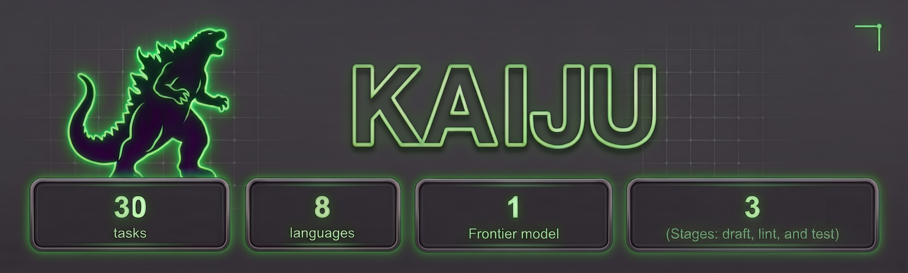
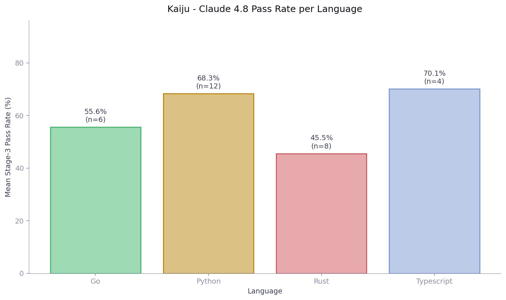
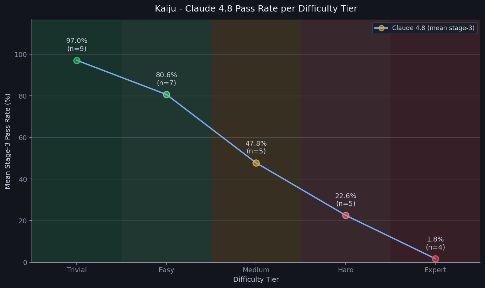

# Kaiju

Kaiju is a reinforcement learning environment for training and evaluating agents on hard, from-scratch library implementation. It is built on the [commit0](https://commit-0.github.io/) methodology.

[](LICENSE)



Each task drops an agent into a containerized checkout of a real open-source repository at `/testbed`, reset to a *skeleton commit* — every function body in the source directory has been replaced by a stub that raises on call. The agent must implement the full library and is graded against the repository's official test suite and an LLM-judged rubric of task-specific correctness criteria. Where SWE-style benchmarks localize a fix inside a working codebase, Kaiju starts from an empty shell and demands the whole organism.

The bar is high by construction. Signatures, class definitions, and exported symbols are pinned by the skeleton and must not be renamed. The upstream test suite is fixed at commit time and is the same suite the reference implementation must pass, so passing partial credit within a test does not exist and there is no room to overfit a bespoke checker.

> **Note:** This release ships 30 tasks with the complete Claude Opus 4.8 agent trajectories — one ATIF v1.7 trace per pipeline stage per module, 1,622 traces in total. Every instance passed a 24-criterion quality-assurance protocol prior to inclusion. Task and trajectory formats are identical to the production deliveries (Harbor `task.toml` schema 1.3, ATIF v1.7).

## Task formulation

A Kaiju task consists of an instruction, a stubbed source tree, the repository's own test suite, a hand-authored ground-truth guide, and a Docker image. The instruction is written the way an engineer would receive the assignment: a task brief plus the embedded specification, not a step-by-step spec of the expected output. The agent must read the skeleton, decide how to decompose the problem across modules, and produce the reasoning.

Each instance is a real open-source library pinned at two commits. The `base_commit` is the skeleton: every function body under `src_dir` has been replaced by a stub, but names, signatures, class and enum definitions, and exported symbols are preserved. The `reference_commit` is the upstream working implementation and is used as the oracle ceiling — `solution/solve.sh` restores it, at which point the full official test suite passes by construction.

Every task is evaluated through a three-stage sequential pipeline. **Stage 1 — Draft** hands the agent the instruction and skeleton with no external feedback; the agent writes the entire library. **Stage 2 — Lint refine** re-runs the agent with the output of an automated linter. **Stage 3 — Test refine** re-runs it with the output of the official test suite. Stage 3 is the primary evaluation point, but every stage is scored, so per-stage deltas (S1 → S2 → S3) measure exactly what lint and test feedback buy. Agent traces are captured per stage and per module, so a task whose source tree spans `k` modules yields up to `3 × k` trajectory files.

Each task also ships a `TRUTH.md`: a hand-authored ground-truth guide covering the problem and the modules under stubbing, the behavioral contract for each public entry point, a suggested solution decomposition in dependency order, the space of equivalent implementation choices that must not be penalized, and known pitfalls. `TRUTH.md` is not shown to the agent — it is a curator artifact used to author rubrics, calibrate the LLM judge, and give downstream users a single-file picture of what "correct" means on that task.

## Score

Kaiju grades two complementary axes and exposes them independently rather than collapsing them into a single number.

1. **Pass rate.** The verifier runs the task's official test suite against the agent's output, normalizes the framework-native report (pytest, `cargo test`, `go test`, vitest) into an ID-level pass/fail table, and writes `atif_verifier/reward.json` with `stage_pass_rate` and `resolved` (`1` iff every expected ID passes) per stage. The denominator is the pinned official ID set from `task.toml`'s `n_test_ids`; no partial credit within a test, no credit for skipped or deselected tests. The runner's exit code is never the grading channel — the reward file is.
2. **Rubric.** An LLM judge scores the final Stage-3 implementation against `tests/rubrics.json`, which holds task-specific behavioral criteria (`ts.*`, derived from `TRUTH.md`) and backbone pipeline criteria (`bb.*`). Each verdict pins its evidence to concrete anchors — source spans, trajectory steps, feedback lines — so a rejected verdict is auditable without re-running the pipeline. Results land in `rubric_results.json`.

Use `stage_pass_rate` for reward shaping during training; use `resolved` (strict) for evaluation.

## Task format

Environments use the [Harbor](https://github.com/laude-institute/harbor) task format, schema 1.3:

```text
task.toml       Metadata: pinned commits, test IDs, verifier config, resource limits, docker_image
instruction.md  The open-ended prompt the agent sees
TRUTH.md        Curator ground-truth guide (not shown to the agent)
environment/    Dockerfiles (base + repo) and the commit0 dataset entry
solution/       Oracle: solve.sh, golden.json (rubric verdicts under the reference), metadata.json
tests/          Verifier: test.sh (entry point), test_outputs.py (normalizer), rubrics.json
trajectories/   Per-model, per-run agent and verifier artifacts
```

`task.toml` pins the runtime environment (`docker_image`, `cpus=2`, `memory_mb=4096`, `workdir="/testbed"`), the source layout (`original_repo`, `base_commit`, `reference_commit`, `src_dir`), the graded ID set (`test_mode="official_test_ids"`, `n_test_ids`), and per-stage budgets (`[agent].timeout_sec=1800`, `[verifier].timeout_sec=1800`). Every task in this release has `[metadata].category="code-generation"` and `[metadata].difficulty="hard"`.

## Quickstart

Prerequisites:

- Docker running
- `python3` (3.11+) for reading `task.toml` via `tomllib`

```bash
git clone https://github.com/Ethara-Ai/kaiju-samples
cd kaiju-samples

UUID=01c3b086-bed0-480d-a9a3-f90525b842e9    # SpectralCluster (Python), 77 tests
TASK="$PWD/$UUID"
IMG=$(python3 -c "import tomllib;print(tomllib.load(open('$TASK/task.toml','rb'))['environment']['docker_image'])")

docker run --rm \
  -v "$TASK/tests:/tests:ro" \
  -v "$TASK/solution:/task/solution:ro" \
  -v "$PWD/logs/$UUID:/logs" \
  "$IMG" bash -c "bash /tests/test.sh; cat /logs/verifier/reward.json"
```

The task image already contains the repository at `base_commit` under `/testbed`. To confirm the oracle ceiling before invoking the verifier, run `bash /task/solution/solve.sh` inside the container — it hard-resets `/testbed` to `reference_commit` and must then score `pass_rate = 1.0`.

## Environment structure

```text
<uuid>/
  task.toml                       # Harbor schema 1.3 metadata
  instruction.md                  # Task shown to the agent
  TRUTH.md                        # Curator ground-truth guide (not shown to the agent)
  environment/
    dataset.json                  # commit0 single-instance dataset entry
    base_image/Dockerfile         # Language toolchain image
    repo_image/Dockerfile         # Repo at base_commit, layered on the base image
  solution/
    solve.sh                      # Fetch + hard-reset /testbed to reference_commit
    golden.json                   # Rubric verdicts under the reference implementation
    metadata.json                 # {instance_id, uuid, task, language, repo}
  tests/
    test.sh                       # Verifier entry point; writes /logs/verifier/reward.json
    test_outputs.py               # Framework-native → ID-level pass/fail normalizer
    rubrics.json                  # Backbone (bb.*) and task-specific (ts.*) criteria
  trajectories/claude-opus-4.8/run_1/
    agent/
      config.json                 # {model, harness, run, language}
      pipeline_results.json       # Per-stage elapsed, cost, pass_rate, eval_status
      tool_calls.jsonl            # Flat log of every tool call across the run
      draft__<repo>__<module>/    # Stage 1 session per module (ATIF v1.7 trajectory.json)
      lint__<repo>__<module>/     # Stage 2 session per module
      test__<repo>__<tests>/      # Stage 3 session per test module
    verifiers/
      atif_verifier/reward.json   # stage_pass_rate + resolved; plus raw stage test outputs
      pytest_results.json         # Framework-native raw report (per-ID pass/fail)
      rubric_results.json         # LLM-judge verdicts against tests/rubrics.json
      reexec.json                 # Deterministic re-execution audit
```

Each `trajectory.json` is one agent session in ATIF v1.7: `schema_version`, `session_id = <instance>__<model>`, `trajectory_id = <instance>__<model>__<stage>__<repo>__<module>`, agent identity and tool definitions, ordered messages with tool calls and edits, and per-session final metrics. Test-stage traces embed full test-run feedback and can grow to hundreds of megabytes on the largest tasks — plan storage accordingly and prefer Git LFS.

## Composition

The current library contains 30 tasks, all Hard difficulty, spanning 10,406 pinned official test IDs and 1,622 agent trajectories. Trace counts scale with the number of modules in the source directory rather than with test count: a task with a wide module tree yields more `draft__*` and `lint__*` traces than a deep, narrow one.

- **Python (12):** transitions, BlackSheep, oauthlib, neat-python, btclib, datasketch, pymonad, jsons, tryalgo, kui, SpectralCluster, etl-parser.
- **Rust (8):** etherparse, erg, nexosim, rust-signals, async-h1, riker, concurrent-map, little-raft.
- **Go (6):** viper, bigcache, colly, uuid, goleak, promptui.
- **TypeScript (4):** graphql-jit, css-select, signature_pad, rollup-plugin-typescript2.

To enumerate tasks by language (each `task.toml` carries exactly one language keyword):

```bash
grep -l '"python"'     */task.toml | xargs -n1 dirname   # 12 Python
grep -l '"rust"'       */task.toml | xargs -n1 dirname   #  8 Rust
grep -l '"go"'         */task.toml | xargs -n1 dirname   #  6 Go
grep -l '"typescript"' */task.toml | xargs -n1 dirname   #  4 TypeScript
```

## Results

All 30 tasks were run through the full three-stage pipeline with Claude Opus 4.8. Stage 3 is the primary evaluation point. The figures below show how outcomes vary by language and by difficulty tier.

**Stage-3 pass rate by language.** Mean final pass rate for each language; bar labels give the task count (`n`). The spread reflects both language maturity in the model and the difficulty of the specific repositories sampled, not an intrinsic ranking of the languages.

<picture>
  <source media="(prefers-color-scheme: dark)" srcset="images/kaiju_pass_rate_per_language-dark.png">
  
</picture>

**Stage-3 pass rate by difficulty tier.** The 30 tasks are ranked by Stage-3 pass rate and grouped into five difficulty tiers; bar labels give the mean pass rate and task count (`n`). Pass rate falls steeply from Trivial (97.0%, n=9) to Expert (1.8%, n=4), reflecting the wide spread of implementation complexity across the library set.

<picture>
  <source media="(prefers-color-scheme: dark)" srcset="images/kaiju_pass_rate_per_tier_line_30final_dark.png">
  
</picture>

## Inspecting a run

```python
import json

uuid = "01c3b086-bed0-480d-a9a3-f90525b842e9"
base = f"{uuid}/trajectories/claude-opus-4.8/run_1/verifiers"

reward = json.load(open(f"{base}/atif_verifier/reward.json"))
rubric = json.load(open(f"{base}/rubric_results.json"))
print("pass_rate stage3:", reward["stage_pass_rate"]["stage3"])
print("rubric verdicts :", sum(v["passed"] for v in rubric["verdicts"]), "/", len(rubric["verdicts"]))
```

## Data availability

- **Hugging Face:** [`ethara/kaiju-samples`](https://huggingface.co/datasets/ethara/kaiju-samples)
- **Format:** per-UUID Harbor task directories with embedded ATIF v1.7 trajectories and verifier reports; large files via Git LFS.

## License

Released under the MIT License. Copyright (c) 2026 Ethara.AI. See [LICENSE](LICENSE).

The underlying open-source repositories retain their original licenses; the MIT grant covers the task curation, harness scripts, trajectories, verifier reports, `TRUTH.md` files, and associated metadata in this repository only.
