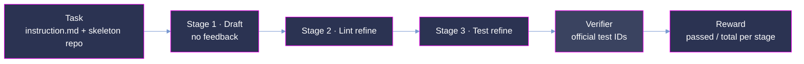

<p align="center">
  
</p>

<p align="center">
  <strong>From-scratch library implementation tasks in Harbor format, with full agent trajectories and stage-wise rewards.</strong>
</p>

<p align="center">
  <a href="#summary"></a>
  <a href="#scoring-methodology"></a>
  <a href="#three-stage-evaluation-pipeline"></a>
  <a href="#verification-and-quality-assurance"></a>
</p>

<p align="center"><sub>
  <a href="#summary">Summary</a> · <a href="#repository-layout">Layout</a> · <a href="#task-design">Task design</a> · <a href="#three-stage-evaluation-pipeline">Pipeline</a> · <a href="#results">Results</a> · <a href="#dataset-structure">Dataset</a> · <a href="#trajectory-structure">Trajectories</a> · <a href="#scoring-methodology">Scoring</a> · <a href="#usage-notes">Usage</a> · <a href="#verification-and-quality-assurance">Verification</a>
</sub></p>

# Kaiju: Library Generation from Scratch

**Kaiju measures whether an agent can implement an entire library from a stubbed skeleton, not
just patch an isolated bug.** Each task drops the agent into a containerized checkout of a real
open-source repository at `/testbed`, reset to a *skeleton commit*: every function body in the
source directory has been replaced with a stub that raises/throws on call. The agent must
implement the full library — architecture, multi-file coordination, project conventions — and is
graded on the fraction of the repository's *official test IDs* that pass. Where SWE-style
benchmarks localize a fix inside a working codebase, Kaiju starts from an empty shell and demands
the whole organism.

Every instance is evaluated through a **three-stage sequential pipeline** (Draft → Lint refine →
Test refine), producing a continuous stage-wise reward suitable for both benchmarking and
RL-style training signal. This release ships each task in
[Harbor](https://github.com/laude-institute/harbor) task format (schema 1.3) together with the
**complete agent trajectories** of the evaluated model, per stage and per module, plus the
verifier evidence for every run.

This drop covers **20 tasks** spanning multiple programming languages (Python, Java, Go, Rust,
TypeScript, JavaScript, C, C++), with baseline runs from **Claude Opus 4.8**.

<!-- TODO(full release): regenerate the headline chart from the final 20-task results -->


> **This is a representative, quality-controlled release of the Kaiju corpus.** The task format
> (Harbor, `task.toml` schema 1.3), the trajectory format (ATIF v1.7), and the scoring are
> identical to the production deliveries. All instances passed a 24-criterion quality-assurance
> protocol prior to inclusion.

## Summary

<!-- TODO(full release): fill exact task counts, language split, tier split, totals -->

| Property            | Value                                                                             |
| :------------------ | :-------------------------------------------------------------------------------- |
| Tasks               | **20** from-scratch library implementation instances                              |
| Languages           | Python, Java, Go, Rust, TypeScript, JavaScript, C, C++ *(final split: TBD)*       |
| Difficulty tiers    | 3 (Easy / Medium / Hard), assigned from structural + behavioral complexity        |
| Model evaluated     | **Claude Opus 4.8** (`claude-opus-4.8`)                                           |
| Pipeline            | 3 sequential stages — Draft (no feedback) → Lint refine → Test refine             |
| Reward              | continuous `passed / total ∈ [0, 1]` per stage, in `verifier/reward.json`         |
| Held-out tests      | official commit-pinned test-ID sets, hundreds–thousands per task *(total: TBD)*   |
| Task format         | [Harbor](https://github.com/laude-institute/harbor) `task.toml` schema 1.3        |
| Trajectory format   | ATIF v1.7 (`trajectory.json`), one trace per pipeline stage × module              |
| Execution           | pre-built per-task Docker images, 4 CPUs / 8 GB, `workdir /testbed`               |

**Headline metrics** (see [Scoring methodology](#scoring-methodology) for the reward definition):

<!-- TODO(full release): replace with aggregate numbers over all 20 tasks -->

| Metric                                     | Value |
| :----------------------------------------- | ----: |
| Claude Opus 4.8 **mean Stage 3 pass rate** |   TBD |
| Claude Opus 4.8 **resolved@S3** (all tests pass) | TBD |
| Mean agent cost per task (USD)             |   TBD |
| Mean wall-clock per task (all 3 stages)    |   TBD |

## Repository layout

```
Kaiju/
├── README.md                          # this document
├── images/                            # figures
│   ├── hero.png                       # README banner
│   └── chart_combined.png             # stage-wise pass rates across the corpus
├── dataset/                           # task definitions, one directory per UUID (20)
│   └── <uuid>/ ...                    # Harbor task: task.toml, instruction.md, solution/, tests/
└── trajectories/                      # model runs, one directory per instance (20)
    ├── <instance>_dataset/
    │   └── claude-opus-4.8/ ...       # results.json, agent/ traces, verifier/ reward
    └── <instance>_dataset_v2_report.json   # trajectory conversion & validation report
```

Task UUIDs under `dataset/` map **1:1** to instance directories under `trajectories/`. Each
instance's repository, language, and difficulty are recorded in its `task.toml`
(`[metadata] original_repo / instance_id / difficulty`). One-liner to list instances by language:

```bash
grep -l '"rust"' dataset/*/task.toml | xargs -n1 dirname | xargs -n1 basename
grep -l '"typescript"' dataset/*/task.toml | xargs -n1 dirname | xargs -n1 basename
```

## Task design

Existing code-generation evaluations predominantly test function-level synthesis (HumanEval,
MBPP) or isolated bug-fixing (SWE-bench). Neither captures the complexity of building an entire
software library: architectural reasoning, multi-file coordination, dependency management, and
adherence to project-wide conventions. Kaiju targets exactly that gap.

Each instance is:

- **A real open-source library** with an established, commit-pinned test suite.
- **Reset to a skeleton commit** (`base_commit`): every function body in the source directory
  (`src_dir`) is replaced by a stub that throws on call. Names, signatures, and exported symbols
  are preserved; the agent must not rename them.
- **Paired with a reference commit** (`reference_commit`): the upstream working implementation,
  used as the oracle ceiling (`solution/solve.sh` restores it).
- **Containerized**: a pre-built Docker image per task pins the language runtime, dependencies,
  and test toolchain (`[environment]` in `task.toml`).
- **Graded against official test IDs**: the exact file-level or assertion-level test identifiers
  in `tests/test_ids.txt` — the agent never sees the verifier.

The agent receives `instruction.md` (task brief + repository details + embedded specification)
and works inside `/testbed`. It must implement only the library source under `src_dir` and must
not modify test files.

### Difficulty assignment

Instances are labeled **Easy / Medium / Hard** in `task.toml.metadata.difficulty`, from:

- Number of files affected (structural complexity)
- Size of the official test-ID set (behavioral complexity)
- Correlation with observed model performance across the corpus

<!-- TODO(full release): fill final tier distribution -->

| Tier   | Tasks | Mean Opus 4.8 S3 pass rate |
| :----- | ----: | -------------------------: |
| Easy   |   TBD |                        TBD |
| Medium |   TBD |                        TBD |
| Hard   |   TBD |                        TBD |

## Three-stage evaluation pipeline

Each task is evaluated through three sequential stages; each stage's output is the next stage's
input, and each stage is scored by the same verifier:

1. **Stage 1 — Draft (no feedback).** The agent receives `instruction.md` and generates an
   initial implementation of the complete library. No external feedback.
2. **Stage 2 — Lint refine.** The generated code is passed through automated linting; the agent
   revises its output in response to lint diagnostics.
3. **Stage 3 — Test refine.** The revised code runs against the official test suite; the agent
   iterates on failures. The Stage 3 pass rate is the primary metric.



Agent traces are captured **per stage and per module**: a task whose source directory spans `k`
modules yields up to `3 × k` trajectory files (`draft__*`, `lint__*`, `test__*`), each a complete
ATIF v1.7 trace of that stage's agent session.

## Results

<!-- TODO(full release): insert final aggregate tables + figures (per-tier bars, per-language split, cost chart) -->
<!-- The table below shows real values from four sample instances, for format illustration. -->

Per-instance stage-wise pass rates for Claude Opus 4.8 (illustrative sample of the corpus):

| Instance       | Language | Tests | S1 pass | S2 pass | S3 pass | Resolved | Cost (USD) |
| :------------- | :------- | ----: | ------: | ------: | ------: | :------: | ---------: |
| `rust-signals` | Rust     |   155 |  0.0000 |  0.4452 |  1.0000 |    ✓     |      25.64 |
| `rust-raknet`  | Rust     |    35 |  0.0000 |  0.4286 |  0.4857 |    ✗     |      18.52 |
| `little-raft`  | Rust     |     2 |  0.5000 |  0.5000 |  0.5000 |    ✗     |       6.55 |
| `mdns-sd`      | Rust     |    80 |  0.0000 |  0.2625 |  0.0000 |    ✗     |      66.01 |

Two properties of the reward design show up immediately:

- **Monotone recovery across stages is common but not guaranteed.** Lint and test feedback lift
  most drafts substantially (`rust-signals`: 0.00 → 0.45 → 1.00), but a stage can also regress
  when a late refactor breaks previously passing behavior (`mdns-sd`: 0.26 → 0.00 at S3).
- **The continuous reward stays informative where a binary metric saturates at zero.** Strict
  resolved@S3 (every official test passing) is rare on Hard instances; the fractional pass rate
  preserves the training signal.

<!-- TODO(full release): images/reward_by_tier.png, images/cost_by_tier.png, per-language chart -->

## Dataset structure

Each task lives under `dataset/<uuid>/` and is fully self-contained:

```
dataset/<uuid>/
├── task.toml                 # Harbor schema 1.3: task, metadata, agent, verifier, environment
├── instruction.md            # the prompt presented to the agent (brief + spec)
├── solution/
│   └── solve.sh              # oracle: fetch + hard-reset to the reference commit
└── tests/
    ├── test_ids.txt          # official test IDs (file-level or assertion-level), one per line
    └── test.sh               # verifier entrypoint: run suite, score IDs, write reward.json
```

### `task.toml` fields

| Section         | Field                              | Description                                                        |
| :-------------- | :--------------------------------- | :----------------------------------------------------------------- |
| *(root)*        | `schema_version`                   | Harbor task schema (`"1.3"`)                                       |
| *(root)*        | `source`                           | Task provenance (`"commit0"`)                                      |
| `[task]`        | `name`, `description`, `keywords`  | Human-readable identity + tags (language, `swe`, `code-generation`) |
| `[metadata]`    | `uuid`                             | Task UUID; matches the directory name                              |
| `[metadata]`    | `category` / `difficulty`          | `"code-generation"` / `easy` \| `medium` \| `hard`                 |
| `[metadata]`    | `original_repo` / `instance_id`    | Upstream GitHub repo / instance identifier (e.g. `commit-0/univer`) |
| `[metadata]`    | `base_commit`                      | 40-char SHA of the skeleton (stubbed) commit                       |
| `[metadata]`    | `reference_commit`                 | 40-char SHA of the working reference implementation                |
| `[metadata]`    | `src_dir`                          | Source directory the agent must implement                          |
| `[metadata]`    | `node_version` *(per-language)*    | Pinned runtime version                                             |
| `[metadata]`    | `test_mode` / `n_test_ids`         | `"official_test_ids"` / size of the graded ID set                  |
| `[agent]`       | `timeout_sec`                      | Per-stage agent budget (1800 s)                                    |
| `[verifier]`    | `timeout_sec`                      | Verifier budget (1800 s)                                           |
| `[environment]` | `docker_image`                     | Pre-built per-task image URI                                       |
| `[environment]` | `cpus` / `memory_mb`               | Container resources (4 / 8192)                                     |
| `[environment]` | `network_mode` / `workdir`         | Network policy / `"/testbed"`                                      |

### Verifier contract

`tests/test.sh` runs the task's official test command with a machine-readable reporter, scores
the expected IDs from `tests/test_ids.txt` against the report, and writes:

```json
// /logs/verifier/reward.json
{"reward": 0.4857, "resolved": 0, "passed": 17, "total": 35}
```

- IDs are **file-level** (`path/to/foo.test.ts`) or **assertion-level**
  (`path/to/foo.test.ts > <full name>`), matching commit0 conventions.
- `reward = passed / total`; `resolved = 1` iff every expected ID passes.
- The runner's exit code is never the grading channel — the reward file is.

## Trajectory structure

Each instance's runs live under `trajectories/<instance>_dataset/`:

```
trajectories/<instance>_dataset/
└── claude-opus-4.8/
    ├── results.json                       # run config + per-stage metrics (time, cost, pass rate)
    ├── agent/
    │   └── <stage>__<module>/             # stage ∈ {draft, lint, test}; one dir per module
    │       └── trajectory.json            # ATIF v1.7 structured trace of the agent session
    └── verifier/
        └── reward.json                    # stage-wise pass rates + resolved flags

trajectories/<instance>_dataset_v2_report.json   # conversion & validation report for the traces
```

### `results.json` fields

| Field                              | Description                                                         |
| :--------------------------------- | :------------------------------------------------------------------ |
| `model` / `model_short`            | Evaluated model id (`claude-opus-4.8`)                              |
| `language`                         | Task implementation language                                        |
| `dataset` / `dataset_short`        | Instance identifier                                                 |
| `start_time` / `end_time`          | Wall-clock bounds of the full 3-stage run                           |
| `stage1`                           | `Draft (no feedback)` — `elapsed_s`, `eval_time_s`, `cost_usd`, `num_passed`, `num_tests`, `pass_rate`, `eval_status` |
| `stage2`                           | `Lint refine` — same metrics, plus `cost_usd_incremental` / `cost_usd_cumulative` |
| `stage3`                           | `Test refine` — same metrics as stage 2                             |

### `verifier/reward.json`

```json
{
  "stage_pass_rate": {"stage1": 0.0, "stage2": 0.4452, "stage3": 1.0},
  "resolved":        {"stage1": 0,   "stage2": 0,      "stage3": 1}
}
```

### `agent/*/trajectory.json` (ATIF v1.7)

Each trace is a self-contained record of one agent session (one pipeline stage on one module):

| Field           | Description                                                                  |
| :-------------- | :---------------------------------------------------------------------------- |
| `schema_version`| `"ATIF-v1.7"`                                                                 |
| `session_id`    | `<instance>__<model>`                                                         |
| `trajectory_id` | `<instance>__<model>__<stage>__<module>`                                      |
| `agent`         | Harness identity: name, version, `model_name`, full `tool_definitions`        |
| `steps`         | Ordered `system` / `user` / `assistant` messages with tool calls and edits    |
| `final_metrics` | Token usage and session-level counters                                        |
| `extra`         | Provenance: pipeline stage, module, source log, cross-check file              |

The top-level `<instance>_dataset_v2_report.json` records the trace conversion QC: units
converted, edit-parse rate, cross-check results against the harness's native history, and mean
reward — so every shipped trajectory is verifiably faithful to the raw agent logs.

## Scoring methodology

The primary metric is the **Stage 3 pass rate** — the proportion of official test IDs passing
after the full Draft → Lint → Test pipeline:

```
pass_rate = passed / total          # continuous, ∈ [0, 1]
resolved  = 1  iff  passed == total # strict, binary
```

- **Numerator:** expected test IDs that pass on the agent's implementation.
- **Denominator:** all IDs in `tests/test_ids.txt` (`n_test_ids` in `task.toml`); no partial
  credit within a test, no credit for skipped/deselected tests.
- **Floor.** A skeleton left unimplemented throws on call, so an untouched submission scores ~0.
- **Ceiling.** `solution/solve.sh` restores the reference commit, which passes the full ID set by
  construction — `reward = 1.0` is attainable on every task.
- **Stage-wise.** The same verifier grades the output of each stage, so per-stage deltas
  (S1 → S2 → S3) measure exactly what lint and test feedback buy.

## Usage notes

### Evaluating a new model

1. Pull the task image from `task.toml [environment] docker_image` (or rebuild an equivalent);
   the repo ships inside at `/testbed`, reset to `base_commit`.
2. Present `instruction.md` to your agent; let it implement `src_dir` (any edits to test files
   are out of contract).
3. Run the verifier and read the reward:

```bash
UUID=<task-uuid>
TASK="$PWD/dataset/$UUID"
IMG=$(python3 -c "import tomllib;print(tomllib.load(open('$TASK/task.toml','rb'))['environment']['docker_image'])")

docker run --rm \
  -v "$TASK/tests:/tests:ro" \
  -v "$PWD/logs/$UUID:/logs" \
  "$IMG" bash -c "bash /tests/test.sh; cat /logs/verifier/reward.json"
```

4. To verify the ceiling first, run `bash /task/solution/solve.sh` inside the container (mount
   the task dir at `/task`) before invoking the verifier — it must score `1.0`.

### Recompute the shipped rewards

No re-execution needed; read the verifier evidence directly:

```python
import json, glob

rates, resolved = {"stage1": [], "stage2": [], "stage3": []}, 0
runs = glob.glob("trajectories/*_dataset/claude-opus-4.8/verifier/reward.json")
for p in runs:
    r = json.load(open(p))
    for s in rates:
        rates[s].append(r["stage_pass_rate"][s])
    resolved += r["resolved"]["stage3"]

for s, xs in rates.items():
    print(f"{s}: mean={sum(xs)/len(xs):.4f}")
print(f"resolved@S3: {resolved}/{len(runs)}")
```

### Inspecting trajectories

```python
import json

t = json.load(open("trajectories/<instance>_dataset/claude-opus-4.8/"
                   "agent/draft__<module>/trajectory.json"))
print(t["schema_version"], t["trajectory_id"])
for step in t["steps"][:5]:
    print(step["step_id"], step["source"], str(step.get("message", ""))[:80])
```

## Verification and quality assurance

Every instance passed a 24-criterion QC protocol prior to inclusion:

- **Structure.** Dataset and trajectory directories matched 1:1 per instance; `task.toml`,
  `instruction.md`, `solution/solve.sh`, `tests/test.sh`, `tests/test_ids.txt` present and
  non-empty in every task; `results.json`, stage trajectories, and `verifier/reward.json`
  present in every run.
- **Reward integrity.** Stage pass rates in `verifier/reward.json` match the harness-reported
  `results.json` per-stage metrics, and `n_test_ids` in `task.toml` matches the line count of
  `tests/test_ids.txt`.
- **Oracle ceiling.** `solution/solve.sh` restores `reference_commit` and passes the full
  official ID set (`reward = 1.0`), so the ceiling is attainable on every task.
- **Trace fidelity.** Each `*_v2_report.json` cross-checks converted trajectories against the
  harness's native logs: 100% edit-parse rate and per-unit validation are required for shipment.
- **Hermetic grading.** The verifier scores only the pinned official ID set with a deterministic
  reporter; the runner's exit code is ignored and the reward file is the sole grading channel.
- **Exclusions.** Instances with pipeline execution failures, time/cost telemetry discrepancies,
  or sentinel values were excluded during curation.
- **Limitations.**
  - **Single-model baseline.** This drop ships Claude Opus 4.8 runs only; tier calibration
    against a second model is future work.
  - **Sample size.** Per-tier and per-language breakdowns average over small n; treat them as
    tendencies, not precise estimates.
  - **Contamination.** The underlying repositories are public; whether specific code appeared in
    a model's training data is unknown.
  - **Model nondeterminism.** Single runs per task; temperature and internal reasoning traces
    produce per-run variance not captured here.

## Data availability

- **Hugging Face**: [`ethara/Kaiju`](https://huggingface.co/datasets/ethara/Kaiju)
- **Format**: Harbor task directories (`dataset/`) + ATIF v1.7 trajectories (`trajectories/`)
- **License**: CC BY-NC-ND 4.0

## Code availability

The evaluation pipeline and curation scripts are maintained at
[github.com/Ethara-Ai/kaiju](https://github.com/Ethara-Ai/kaiju).

## Citation

```bibtex
@misc{kaiju2026,
  title={Kaiju: A Dataset for Evaluating AI Code-Generation on Library Synthesis from Specifications},
  author={Ethara AI},
  year={2026},
  howpublished={\url{https://huggingface.co/datasets/ethara/Kaiju}},
  note={Harbor-format library-generation tasks with stage-wise rewards and full agent trajectories.}
}
```

## License

Released under **CC BY-NC-ND 4.0**
([Creative Commons Attribution-NonCommercial-NoDerivatives 4.0 International](https://creativecommons.org/licenses/by-nc-nd/4.0/)),
copyright Ethara.AI 2026.

- **BY** — credit must be given to the creators
- **NC** — non-commercial use only
- **ND** — no derivatives or adaptations

The underlying open-source repositories retain their original licenses; this license covers the
dataset curation, evaluation results, trajectories, and associated metadata only.
